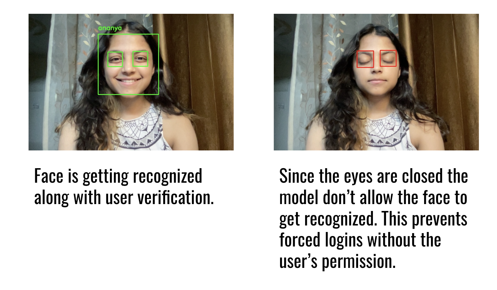
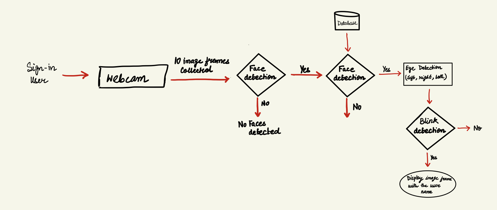

# Example 

<h2>Step 1<h2/>
Click <a href="https://drive.google.com/drive/folders/1fYOfs87N4b5hA8MiQce1VtAPR1kqPFLi?usp=sharing">here</a>
This will take you to the Face recognition authentication code. 

<h2>Step 1<h2/>
Open 'eyestatus.ipynb' file on 

<h2>Step 2<h2/>
Mount Google drive in the same colab notebook by navigating to folder icon on the left bar and clicking on 'mount google drive'. Go to drive/MyDrive/Msft-engage-fr. If the path matches then run the whole .ipynb file
  

 <h2>Step 3<h2/>
 In order to run face authentication model on yourself, open your web cam and click 10 pictures of yourself (atleast one of them should have eyes closed) and move the images to <a href="https://drive.google.com/drive/folders/1BkYI2WZt8C-XUa6vC7eTqmWLWoMly1Zn?usp=sharing"> Your_first_name</a> then move three images to <a href="https://drive.google.com/drive/folders/1VoGy95KT-whCkDrkl5qQv6wACRkJiSLd?usp=sharing">faces folder</a> and name them as a.jpg, b.jpg and c.jpg.Delete the already present three sample images, where image a and c should have open eyes and b shoul dhave closed. This shows blinking!. If you don't want to click your picture then kindly find three sample images in faces folder.   

<h2>Step 4<h2/>
Running of this whole Py-script-FR file would take 15 minutes since the model is being trained. The final output should look something like this - 
 
 

  
 
<h2>Step 5<h2/>
  You should be able to see your image in the <a href="https://drive.google.com/drive/folders/1fYOfs87N4b5hA8MiQce1VtAPR1kqPFLi?usp=sharing">Msft-engage-fr</a> folder
  
  <h2>Step 6<h2/>
  Below shows the two types of outputs - 
   

  

  
<h2>Pipeline of the face recognition<h2/>

   
