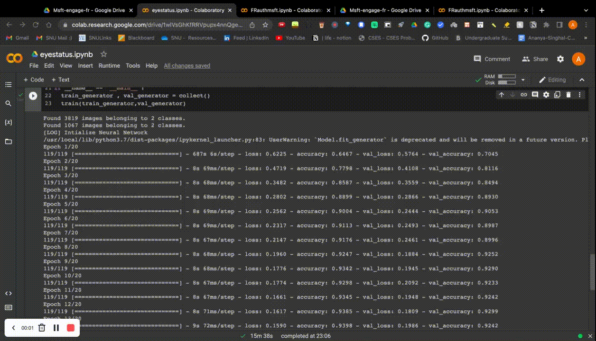

# Example 

<h2>Step 1<h2/>
Click <a href="https://drive.google.com/drive/folders/1fYOfs87N4b5hA8MiQce1VtAPR1kqPFLi?usp=sharing">here</a>
This will take you to the Face recognition authentication code. 

<h2>Step 1<h2/>
Open 'eyestatus.ipynb' file on 

<h2>Step 2<h2/>
Mount Google drive in the same colab notebook by navigating to folder icon on the left bar and clicking on 'mount google drive'. Go to drive/MyDrive/Msft-engage-fr. If the path matches then run the whole .ipynb file

<h2>Step 3<h2/>
Running of this file would take 15 minutes since the model is being trained. The final output should look something like this - 
 

<h2>Step 4<h2/>
Next open  file 

  
<h2>Step 5<h2/>
 Open your web cam and click 3 pictures of yourself (atleast one of them should have eyes closed) and move the images to <a href="https://drive.google.com/drive/folders/1VoGy95KT-whCkDrkl5qQv6wACRkJiSLd?usp=sharing">faces folder</a> and name them as a.jpg, b.jpg and c.jpg.Delete the already present three sample images. If you don't want to click your picture then kindly find three sample images in faces folder. 
  
 
<h2>Step 7<h2/>
  You shoul be able to see your image in the <a href="https://drive.google.com/drive/folders/1qgveysS8WqxVB-Gv57q1F0XEvkHWNImp?usp=sharing">Final output</a> folder
  

  
<h2>Pipeline of the face recognition<h2/>

   
